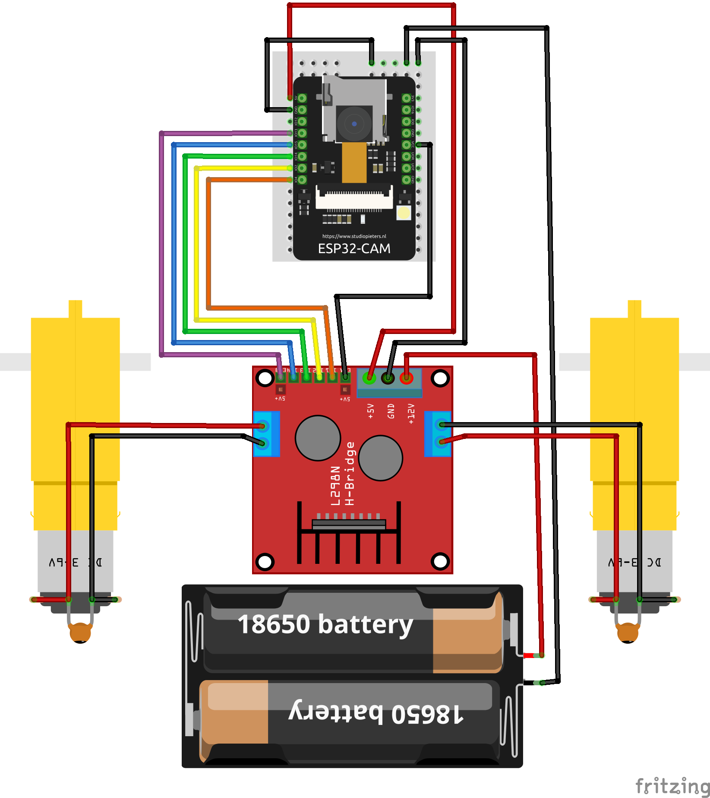
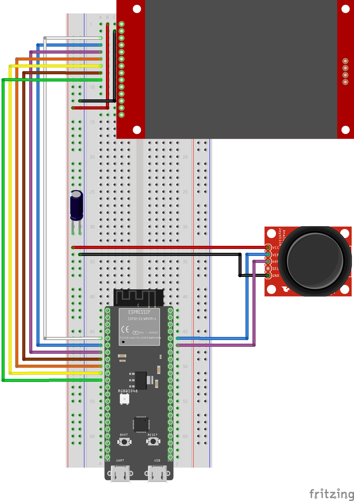

# Blitzreiter

_From german "blitz" - flash and "reiter" - driver_

Remotely controlled robotic car build with ESP32

## [EN]

This repository contains source code for semestral work in subject BI-ARD 2023/24. Repository contans two [PlatformIO](https://platformio.org/) projects.

- blitzreiter - contains code for esp controlling car robot
- beobachter - contains code for remote control

Project also contains testing servers written in Python, which were used during development.

After switching on, the controller starts sending WiFi by default with SSID "blitzreiter" to which the car connects. If you want you can change the name and password by changing the compilation constants `WIFI_SSID` & `WIFI_PASSWORD`. Communication is then done via TCP using the `WiFiServer` and `WiFiClient` classes.

To speedup connection turn the controller on first, wait few seconds and then switch the car on.

## [CZ]

Tento repozitář obsahuje zdrojový kód semestrální práce v předmětu BI-ARD 2023/24. Repozitář obsahuje dva [PlatformIO](https://platformio.org/) projekty.

- blitzreiter - obsahuje kód pro esp ovládající robotické vozítko
- beobachter - obsahuje kód pro dálkové ovládání

Repozitář také obsahuje testovací servery napsané v Pythonu, které byli použity během ranných fází vývoje.

Po zapnutí začne ovladač vysílat WiFi ve výchozím nastavení s SSID "blitzreiter" na kterou se vozítko připojí. Pokud chcete můžete změnit jméno a heslo změnou kompilačních konstant `WIFI_PASSWORD` & `WIFI_SSID`. Komunikace pak probíhá pomocí TCP využitím tříd `WiFiServer` a `WiFiClient`.

Pro urychlení navázání spojení zapněte nejdříve ovladač a po pár vteřinách vozítko.

## Hardware

### Car / Vozítko

- ESP32-CAM AI-Thinker
- LN298 Motor driver
- Small breadboard
- 2x DC 3-6v Motor with gearbox
- 2x Wheel with tire
- 2x Ceramic capacitor 104 (for motor noise reduction)
- Omnidirectional wheel
- Acrylic body
- 2x Li-ion battery 18650
- Battery holder

### Controller / Ovladač

- ESP32S3-DevkitC-1 R8N16 _(or any similar but keep in mind JPEGs and WiFi needs lots of ram)_
- Display 2,4" 240x320 SPI TFT ILI9341
- PS2 Joystick module
- 100uF polarized capacitor _(for voltage smoothing)_

### Wiring / Zapojení

## Credits

Inspired by:
- https://github.com/Steve5451/esp32-stream-desktop/
- https://github.com/Bodmer/TFT_eSPI/blob/master/examples/480%20x%20320/TFT_flash_jpg/TFT_flash_jpg.ino
- https://randomnerdtutorials.com/esp32-cam-car-robot-web-server/
- https://www.bitsanddroids.com/post/creating-our-first-esp32-flight-display-graphics
- https://esp32io.com/tutorials/esp32-joystick
- https://lastminuteengineers.com/esp32-pwm-tutorial/
- https://realpython.com/python-sockets/
- https://randomnerdtutorials.com/esp32-useful-wi-fi-functions-arduino/
- https://www.upesy.com/blogs/tutorials/how-create-a-wifi-acces-point-with-esp32